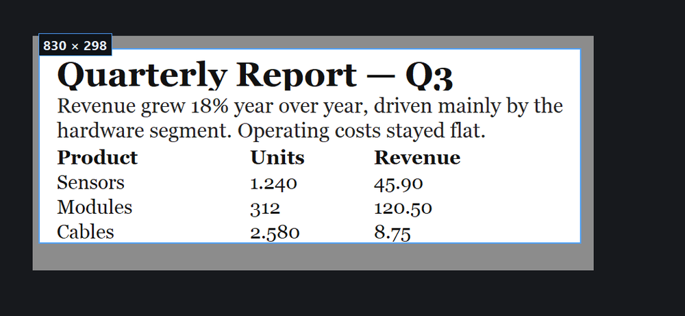
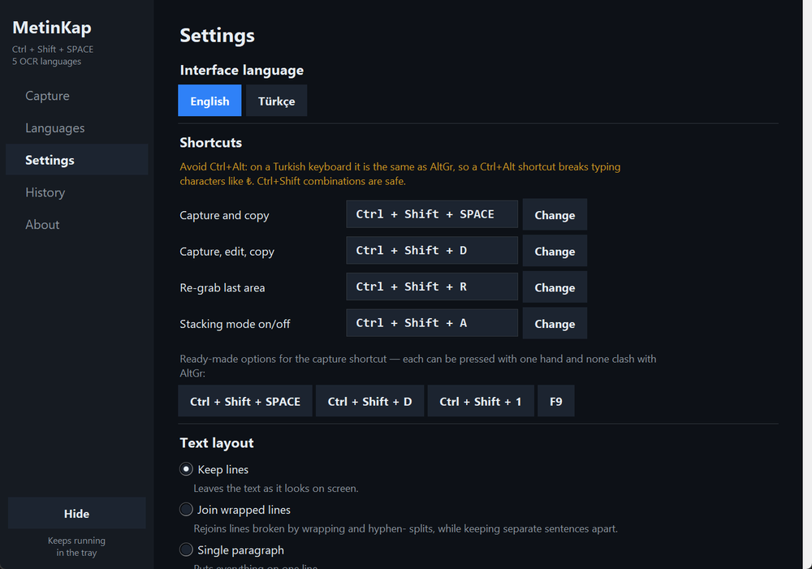
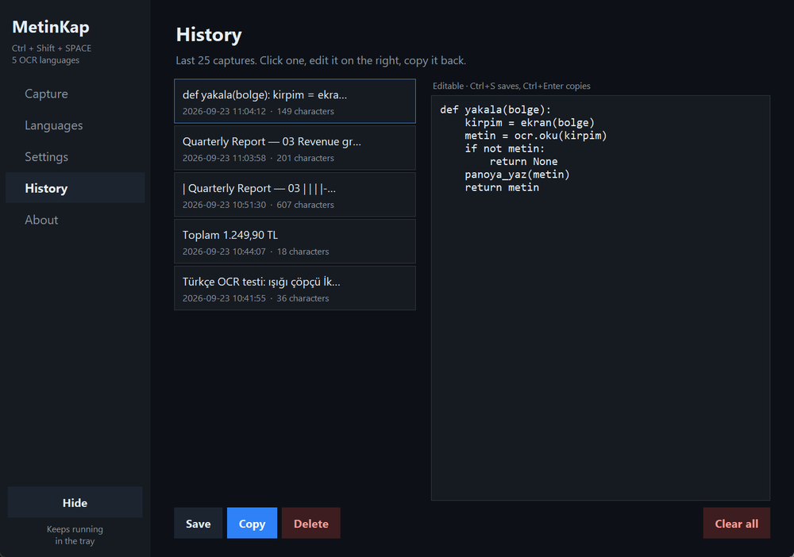
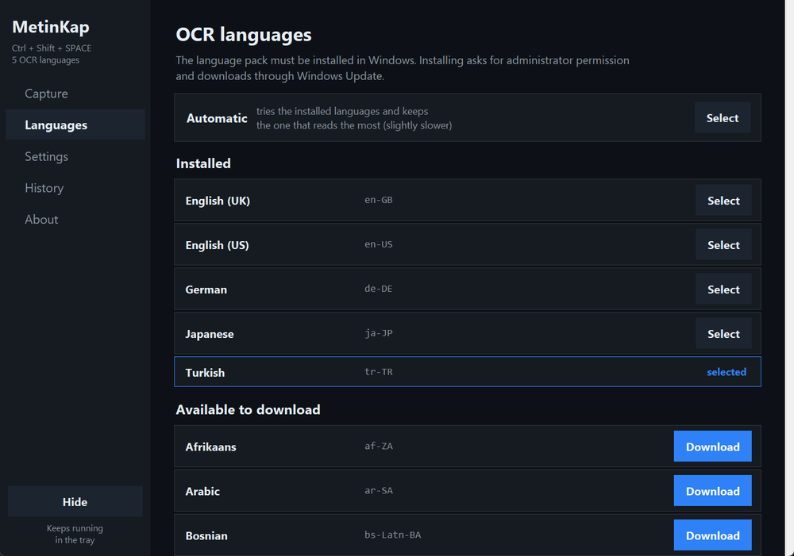

# MetinKap

Grab text from anywhere on screen — documents you can't select, images, video frames — and
put it on the clipboard with one shortcut. Uses the OCR engine built into Windows
(`Windows.Media.Ocr`): no install, no internet, **~15–50 ms** per capture.

[](LICENSE)


*Türkçe: [README.tr.md](README.tr.md)*



The screen freezes, you drag over what you want, and the text is on your
clipboard — typically in 15–50 ms.

## Install

```
kurulum.bat
```

Creates the virtualenv under `%USERPROFILE%\venvs\metinkap` (outside OneDrive, so sync
doesn't fight it). Then run `baslat.bat` — a tray icon appears next to the clock.

| File | What it does |
|---|---|
| `baslat.bat` | Runs it silently |
| `konsol-ile-baslat.bat` | Runs it with a console (for troubleshooting) |
| `testleri-calistir.bat` | Runs the test suites |
| `otomatik-baslat.bat` | Adds/removes it from Windows startup — Settings does the same |

## Use

| Shortcut | What it does |
|---|---|
| `Ctrl+Shift+Space` | Select an area → text goes straight to the clipboard |
| `Ctrl+Shift+D` | Select an area → review and edit → `Ctrl+Enter` to copy |
| `Ctrl+Shift+R` | Re-grab the **last area** without selecting again |
| `Ctrl+Shift+A` | **Stacking mode** on/off — see below |

On the selection overlay: **drag** to select (live size readout), **hold Shift while
releasing** to edit first, **Enter** to reuse the last area, **Esc** or **right click** to
cancel. Then just `Ctrl+V`.

`Ctrl+Shift+R` is the one worth remembering: when you page through a document and the text
sits in the same place every time, you never have to draw the box again.

### Stacking mode

Press `Ctrl+Shift+A` and captures stop going to the clipboard — they collect instead. Grab
page after page, then press `Ctrl+Shift+A` again and all of it lands on the clipboard as one
block. A twelve-page document becomes twelve captures and **one** paste instead of twelve.
The separator between pieces is `biriktir_ayirici` in the config (a blank line by default).

### Changing a shortcut

Settings → Shortcuts → **Change** → press the combination you want. It is read through Win32,
so it gets the right key on a Turkish layout too. If the combination is taken, nothing is
saved and the old shortcut comes back.

> **Don't use Ctrl+Alt.** On a Turkish keyboard `Ctrl+Alt` *is* `AltGr`. A `Ctrl+Alt+T`
> hotkey means you can no longer type `₺`. This is why the original default was changed;
> old config files are migrated to the new default on startup.

## Interface

Double-click the tray icon. Five tabs:




- **Capture** — capture button, last captured text, copy again
- **Languages** — installed languages (click to select) and downloadable ones (click to install)
- **Settings** — interface language, shortcuts, text layout, recognition options, autostart
- **History** — last 25 captures, **editable**: fix an OCR slip and copy it back
- **About** — accuracy table, file locations

The interface is English by default and switches to Turkish from Settings; the tray menu
follows too.

### Text layout modes

Beyond keeping or joining lines, two modes rebuild structure from **where words sit on
screen**:

- **Keep indentation (code)** — Windows OCR throws away leading spaces, so pasted code loses
  its shape. This clusters the x position of each line back into indent levels. Measured on a
  rendered function: levels came back as `0, 4, 8, 4, 0`, exactly the original.
- **Table (Markdown)** — finds column boundaries from word positions and writes a Markdown
  table, so rows and columns survive the paste:

  ```
  | Urun   | Adet | Fiyat  |
  |--------|------|--------|
  | Kalem  | 12   | 45.90  |
  ```

Tables and code are the two cases where a screenshot used to be unavoidable.

### Paste back into the window you came from

Off by default. When on, the app brings the window that was in front before the capture back
and sends `Ctrl+V`. It waits for you to release the shortcut keys first (otherwise `Ctrl+V`
would arrive as `Ctrl+Shift+V`) and does nothing at all if focus did not return to that exact
window — it will not type into the wrong place.

### History



Captures survive a restart (`gecmis.json`). Click an entry, edit it on the right, then
**Save** / **Copy** / **Delete** / **Clear all**. `Ctrl+S` saves, `Ctrl+Enter` copies.
Switching entries saves your edit automatically, so nothing is lost.

## Languages



35 languages are listed. **Download** asks for administrator permission and pulls the pack
through Windows Update (can take a few minutes). Once installed it moves up to the installed
list and becomes selectable.

**Automatic** tries each installed language and keeps whichever reads the most — useful for
mixed-language documents, slightly slower.

> Windows only reveals a newly installed OCR language to a **freshly started** process. When
> that happens the app says so and offers a **Restart now** button; it relaunches itself,
> keeping your settings and history.

From a command line instead (elevated PowerShell):

```powershell
Add-WindowsCapability -Online -Name "Language.OCR~~~fr-FR~0.0.1.0"
```

## Accuracy

Measured (Segoe UI, Turkish text, character similarity):

6 fonts × 6 sizes, with text containing numbers and punctuation:

| Scale | Accuracy |
|---|---|
| ×1 | 80.15% |
| ×2 | 91.03% |
| **×2.5** | **90.18%** (used) |
| ×3 | 89.35% |

What the measurements settled:

- **Upscaling matters most.** Small selections are often read as *nothing* without it.
- **×2.5, not ×3.** ×3 wins on clean prose but corrupts numbers — `KDV %18` came out as
  `KDV 9618`. ×2.5 is as good on prose and safer on figures.
- **Adaptive scaling isn't worth it.** A version that ran a first pass, measured the line
  height and re-read at the right scale scored 89.88% — no better than a fixed ×2.5, for
  double the work.
- **Contrast stretching and greyscale hurt** (99.6% → 95.0% at 11pt), so neither is applied.
- **Trying several scales and auto-picking doesn't pay.** Four scales with automatic scoring,
  over 5 fonts × 5 sizes: fixed ×3 scored 98.20%, the best scoring function 98.06%, and the
  theoretical ceiling only 98.89%. Three to four times the cost for nothing.
- **Dark themes are fine** (99.3%) — no inversion needed.
- **No other OCR engine is worth adding.** RapidOCR (PP-OCRv5 latin) was measured against the
  Windows engine on this machine: 750 ms versus 15 ms, and *less* accurate in Turkish — the
  shared latin model turns dotless `ı` into `i`, and PaddleOCR has no Turkish model.
  PaddleOCR and Surya cannot be installed on Python 3.14 at all; EasyOCR and docTR drag in
  ~2.5 GB of torch. Cloud OCR would send every crop to a server for ~30× the latency.

Known limit: with meaningless all-caps runs and a leading `İ`, the engine sometimes gets the
case wrong. It is dictionary-assisted, so this doesn't show up in ordinary text.

If nothing comes out: select a wider area (a whole line rather than one word), or switch the
language.

## Performance notes

Two measured choices in the capture path:

- The crop is encoded as **BMP, not PNG**, before it goes to the OCR engine — no compression
  pass on an image that is thrown away immediately.
- `Ctrl+Shift+R` grabs **only its region** through GDI `BitBlt` (~4 ms) instead of capturing
  the whole 2560×1600 virtual screen and cropping (~55 ms). The results are pixel-identical;
  there is a fallback to the PIL path if the GDI call fails.
- Dimming the overlay uses a lookup-table `point()` pass rather than `Image.blend` — same
  output, a third of the time.

## Files

Code:

| File | Contents |
|---|---|
| `metinkap.py` | OCR, clipboard, global hotkeys, selection overlay, tray icon |
| `arayuz.py` | Settings window |
| `diller.py` | Language table, elevated pack install, autostart |
| `ceviri.py` | Interface strings (en / tr) |
| `tests/` | Test suites — `python tests/calistir.py` |

User data lives in `%APPDATA%\MetinKap\`:

- `config.json` — settings; edited through the UI, but hand-editable. Invalid values are
  repaired on load rather than crashing the app, and writes are atomic.
- `gecmis.json` — history, survives restarts
- `gecmis.txt` — append-only log with timestamps
- `son_kirpim.png` — the last selected area, for when a reading looks wrong
- `hata.log` — errors

## Tests

```
testleri-calistir.bat              # everything
testleri-calistir.bat --hizli      # only the suites that open no windows
```

The tests need the packages, so they have to run with the interpreter from the
virtualenv — the `.bat` above takes care of that. By hand it would be:

```
"%USERPROFILE%envs\metinkap\Scripts\python.exe" tests\calistir.py --hizli
```

Six suites, 100+ checks: settings and history storage (including concurrent
writes), text layout modes, stacking, paste-back safety, the settings window in
both languages, and the language-install flow. Two of them open real windows and
capture the screen, so don't use the machine while they run — `--hizli` skips
those.

One thing is **not** verified and is marked as such in the suite: the
"clipboard busy" path in `panoya_yaz`. On this machine `OpenClipboard` succeeds
even while another process holds the clipboard, so the failure branch could not
be triggered.

## Contributing

Issues and pull requests are welcome. One thing to know up front: **identifiers
and comments in the code are Turkish**, while the interface and documentation
are English. That is a deliberate choice, not an oversight — if you send a patch,
please keep the surrounding style rather than renaming things.

## How it works

1. The shortcut is caught system-wide with `RegisterHotKey` (own thread + message loop)
2. The whole virtual screen is captured in one frame and shown dimmed as a full-screen
   overlay; the selected region stays bright
3. The crop is upscaled, written to memory as BMP, and read by `Windows.Media.Ocr`
4. Pieces sitting in the same horizontal band are rejoined into one line, the layout mode is
   applied, and the result is written to the clipboard as `CF_UNICODETEXT`

Multi-monitor and DPI scaling are handled (`PER_MONITOR_AWARE_V2`, set before any window is
created). The settings window measures the DPI and scales its pixel constants to match.
